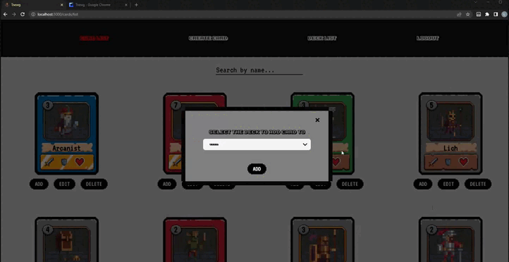

# TNEWG
#### An online deckbuilder for the world's #1 most popular made up card game.

### Project Description
The culmination of my time at Nashville Software School. A fullstack app built with React, C#, SQL and SCSS. It was made for fans of the very real and definitely playable Tnewg card game.
Features include:
* Creating a Deck, which you can then add cards to from the searchable card list. You are limited to 15 cards in a deck, and will be prompted to either cancel your attempt to add more, or replace one of the cards in the deck with whatever card you are trying to add to it.
* Change the name of your deck, as well as delete it. Remove cards that have been added.
* As an admin, you can create and update cards, inputting a name as well as choosing a variety of cosmetic options from a custom select menu, such as the background or border color of the card. As you do so, a dynamic preview of the card is shown.

### Tech Stack

    

### Image Gallery

#### Login

#### Card List

#### Card Create

#### Add Card to Full Deck

#### Deck View / Edit / List

#### Card Edit

#### ERD

#### Wireframe

